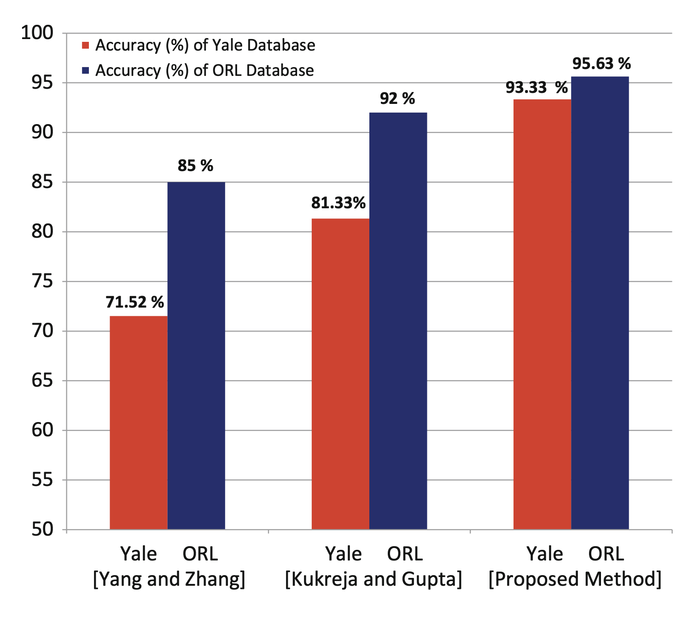

# Face Recognition Using PCA and Minimum Distance Classification

## Overview
A face recognition system leveraging Principle Component Analysis (PCA) and Minimum Distance Classification (MDC) to achieve high accuracy across diverse datasets, considering variations in expressions, poses, and lighting conditions It demonstrates impressive accuracy rates of 95.63% and 93.33%, respectively, despite variations in facial expressions, poses, and illumination.

## Methodology
Utilized principle component analysis (PCA) for feature extraction and minimum distance classification for classification, this approach is tested on the ORL and YALE datasets. 

### Feature Extraction
- **PCA (Principle Component Analysis):** Utilized for the robust extraction of facial features, serving as the foundational step of the recognition process.

### Classification
- **Minimum Distance Classification:** These extracted features are classified, focusing on achieving high accuracy with minimal computational complexity.

## Results
Proposed method was rigorously tested on two renowned face datasets:
- **ORL Dataset:** Achieved an accuracy rate of 95.63%.
- **YALE Dataset:** Recorded an accuracy rate of 93.33%.

  

These results underscore the effectiveness of our proposed combination, particularly in handling diverse facial expressions and challenging conditions.

## Conclusion
The research validates the efficiency of combining PCA with minimum distance classification for face recognition, proving to be a formidable approach across different datasets. This method stands as a testament to achieving high accuracy in face recognition, navigating the common obstacles posed by variable facial expressions, poses, and illumination conditions.

